# datafactory
datafactory : #bicep #azure-data-factory #copy #blob

## Objective
Perform demo of using Bicep to create an Azure data factory. 
The pipeline perform copies data from one folder to another folder in an Azure blob storage.

## Data Factory : Copy blob using Bicep

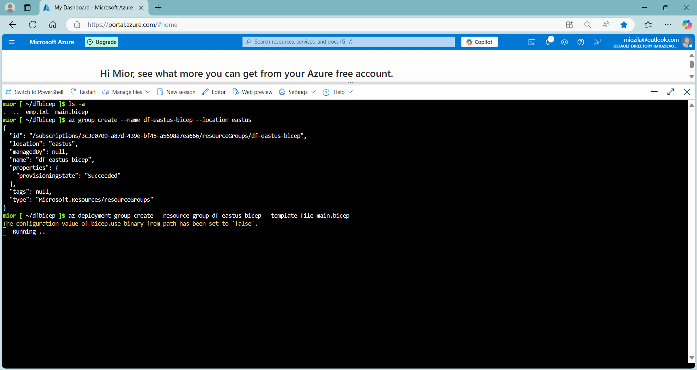

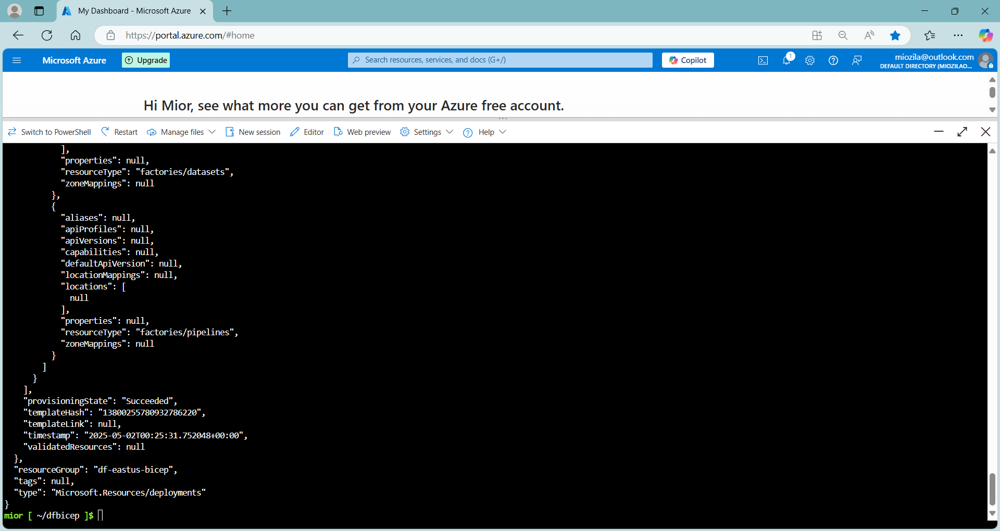

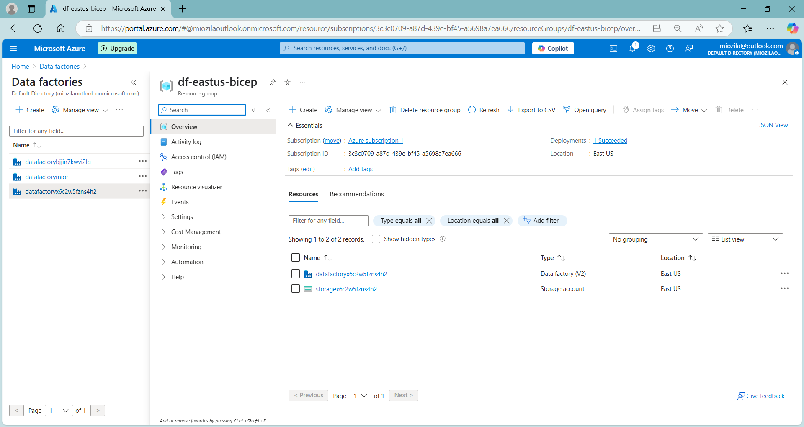

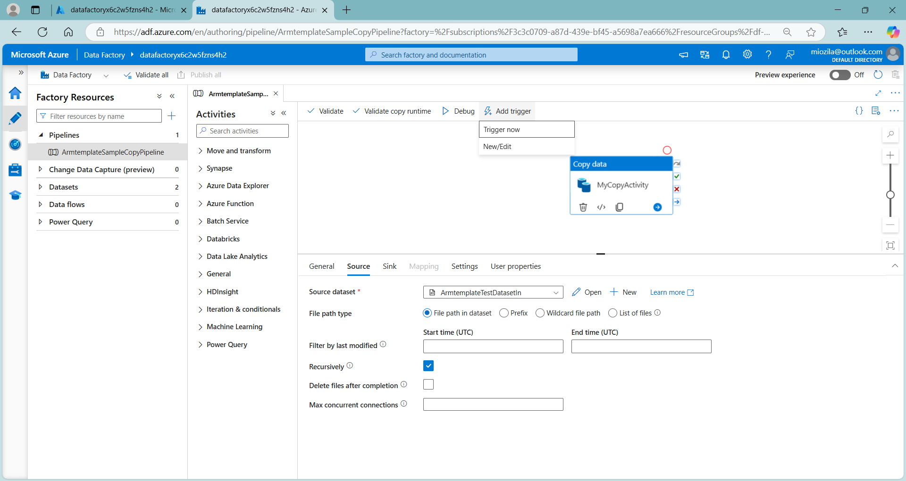

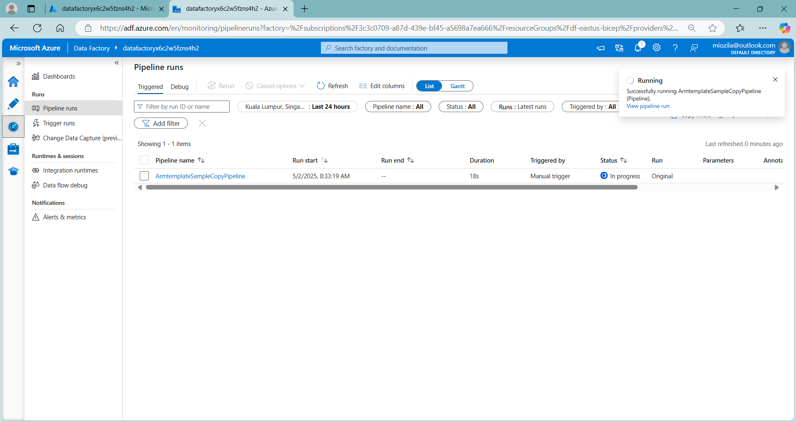

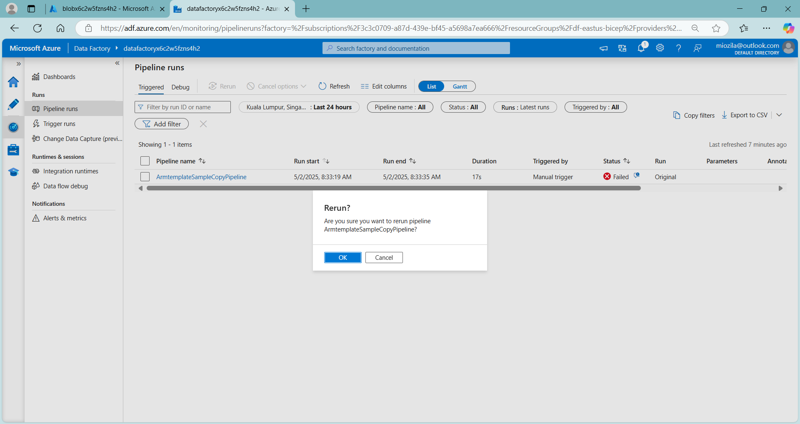

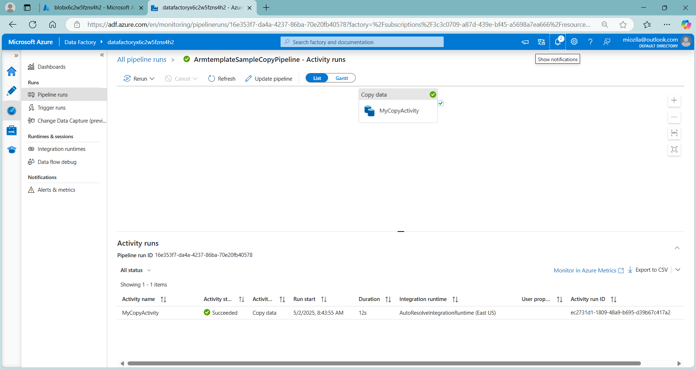

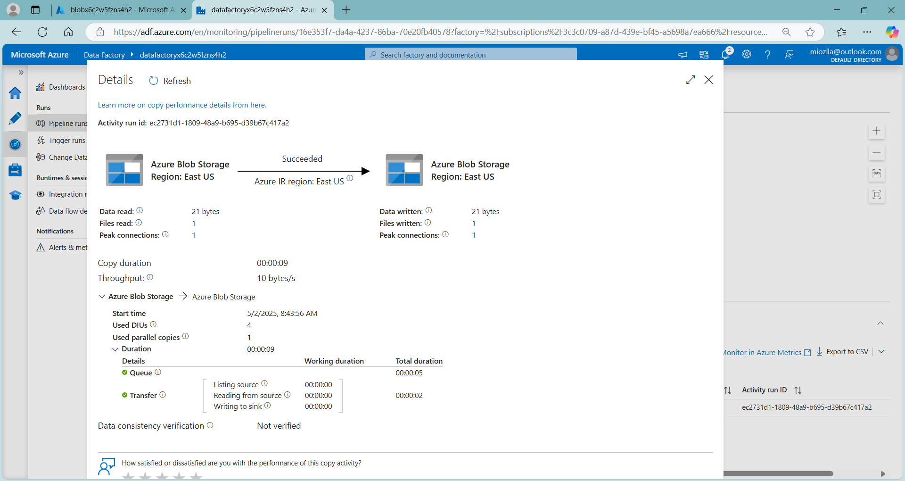

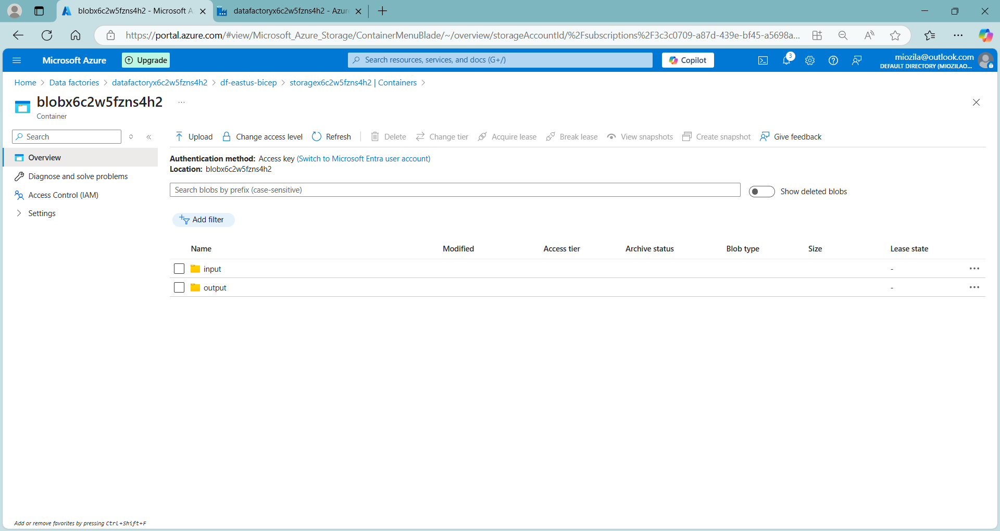

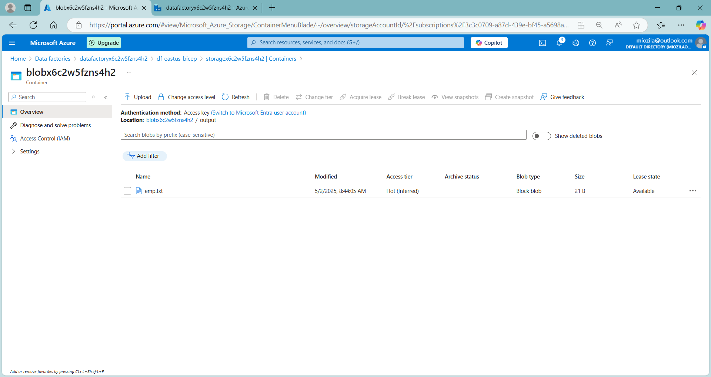

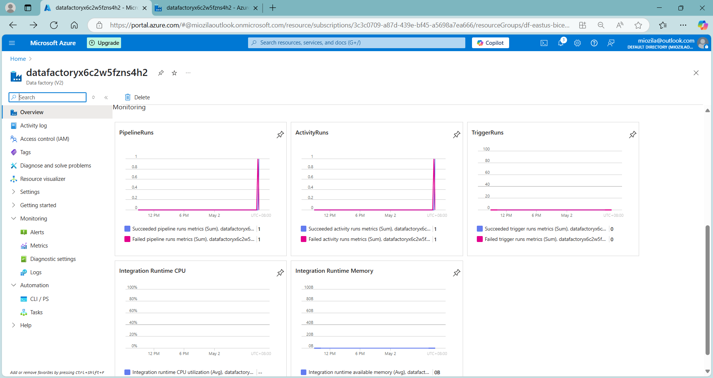
